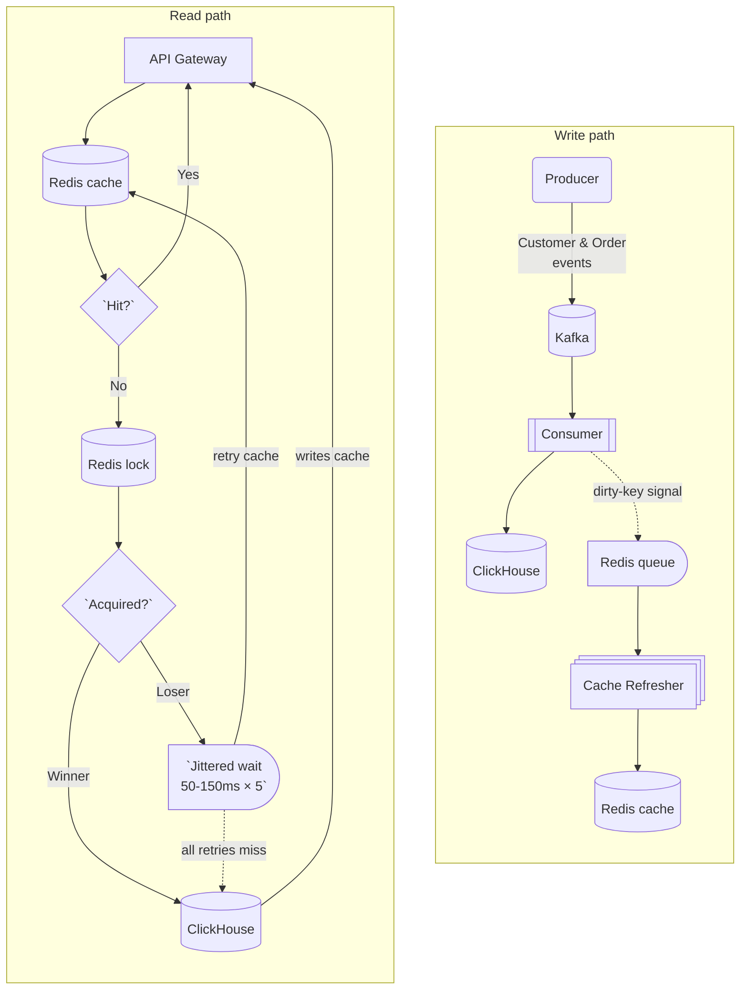

# order-summary-service

A low-latency order-summary API backed by Kafka event ingestion, ClickHouse current-state tables, and a Redis read-through cache with stampede protection.

The service exposes a single REST endpoint that returns a rolling 30-day order summary for a customer, with UTC start-of-day window boundaries. It implements:

- Event-driven ingestion over Kafka with idempotent, batched writes to ClickHouse
- Current-state tables in ClickHouse with `ReplacingMergeTree` and `FINAL` reads
- Redis read-through cache with distributed locking, jittered retry, and proactive background refresh for hot keys

## Components

| Binary | Role |
|---|---|
| `cmd/producer` | Sample event generator — emits `CUSTOMER_CREATED` and `ORDER_CREATED` events to Kafka at a configurable rate and mix |
| `cmd/consumer` | Kafka consumer — batches events into ClickHouse current-state tables and enqueues cache-refresh signals for affected customers |
| `cmd/cache-refresher` | Background worker — drains the Redis refresh queue and proactively rebuilds cached summaries for hot customers |
| `cmd/api` | REST API — serves `GET /v1/customers/{customerId}/monthly-order-summary` with a Redis read-through cache and ClickHouse fallback |

## Architecture



## Key Design Decisions

### 1. ClickHouse for current-state storage

ClickHouse is chosen for time-window aggregations over customer order history. `ReplacingMergeTree` tables keep only the latest version of each row (by `order_time` for orders, `updated_at` for customers), and `FINAL` is applied at read time to force immediate deduplication. The same tables can serve analytics workloads without schema changes.

### 2. FINAL reads for correctness

All read queries use the `FINAL` modifier, which forces ClickHouse to deduplicate unmerged parts before returning results. This guarantees correct aggregations on every request at the cost of higher read latency. At higher scale, pre-aggregated materialized views with `AggregatingMergeTree` would be the next step; for this service's data volume, `FINAL` is acceptable.

### 3. Read-through cache over write-through

Write-through would require a cache update on every ingested event. Read-through warms only the keys that are actually requested, creating natural hot/cold separation. A background refresher handles proactive warming for hot customers after writes.

### 4. Dirty-key queue for proactive refresh

When the consumer writes a batch of orders, it enqueues a refresh signal in Redis for each affected customer. The cache refresher picks these up and rebuilds the cache entry before the next API request arrives. A `SetNX`-based pending flag deduplicates signals for the same customer within a TTL window, so a burst of writes produces at most one refresh job per customer.

### 5. Token-based distributed lock release

A naive `DEL` on a Redis lock is unsafe: if the lock's TTL fires while the winner is still executing its ClickHouse query, another goroutine can acquire the same key. When the original holder's deferred `DEL` runs, it frees the new holder's lock, immediately exposing the key to a third goroutine. This service stores a UUID token as the lock value at acquire time and releases using a Lua script that atomically checks the stored token matches the caller's before deleting. A mismatched token — meaning the lock expired and was re-acquired — is a no-op.

### 6. LockTTL > ClickHouseTimeout by design

The lock must outlive the winner's database query. `LOCK_TTL_SECONDS` defaults to 20s; `CLICKHOUSE_TIMEOUT_SECONDS` defaults to 15s. A lock that expires before the query finishes lets losers stampede ClickHouse — exactly what the lock exists to prevent.

### 7. Jittered retry with DB fallback for losers

On a cache miss, losers wait up to 5 retries with 50–150 ms jitter per attempt (~750 ms worst-case) for the winner to populate the cache. Losers that exhaust retries fall through to ClickHouse directly. Critically, only the lock holder (winner) writes the result to cache — a loser that falls through to the DB does not write, preventing it from overwriting a fresher entry the winner may have just stored.

## Quick Start

Start the infrastructure:

```bash
docker compose -f deploy/docker-compose.yml up
```

`make build` compiles all four binaries into `bin/`. `make run` starts all four concurrently in the background (equivalent to running each with `&` in a shell). The producer starts with default flags (3s interval, 100 events per tick, 0.5 customer ratio). For realistic traffic control, run each binary in a separate terminal:

```bash
go run ./cmd/consumer
go run ./cmd/cache-refresher
go run ./cmd/api
go run ./cmd/producer -interval=2s -size=50 -customer-ratio=0.4
```

Producer scenarios:

```bash
# Hot-key scenario (single customer)
go run ./cmd/producer -interval=1s -size=200 -customer-ratio=0.2 -customer-id=C123

# Duplicate and update-like traffic
go run ./cmd/producer -interval=2s -size=100 -customer-ratio=0.3 -dup-percent=20 -order-upgrade-percent=30
```

## API Reference

`GET /v1/customers/{customerId}/monthly-order-summary`

Returns the rolling 30-day order summary for the customer, with the window anchored to UTC start-of-day boundaries.

Response:

```json
{
  "customer_id": "C123",
  "window_from": "2025-11-15",
  "window_to": "2025-12-15",
  "order_count": 5,
  "total_spend": 3890.50,
  "currency": "TRY",
  "source": "cache"
}
```

`source` is `"cache"` on a Redis hit (including hits found during lock-wait retries) and `"db"` on a ClickHouse fallback.

Status codes: `200 OK` · `404 Not Found` (customer does not exist) · `500 Internal Server Error`

**Currency assumption:** The aggregation assumes one currency per customer. If a customer has orders in multiple currencies, `total_spend` sums across all of them while `currency` reflects an arbitrary one. This invariant is expected to be enforced at order ingestion time.

## Deep Dives

### Event Schema & Kafka Topics

Customer event (topic: `KAFKA_CUSTOMER_TOPIC`):

```json
{
  "event_id": "uuid",
  "event_time": "2025-12-01T10:00:00Z",
  "event_type": "CUSTOMER_CREATED",
  "customer_id": "C123"
}
```

Order event (topic: `KAFKA_ORDER_TOPIC`):

```json
{
  "event_id": "uuid",
  "event_time": "2025-12-10T14:30:00Z",
  "event_type": "ORDER_CREATED",
  "order_id": "O456",
  "customer_id": "C123",
  "total_amount": 1250.75,
  "currency": "TRY"
}
```

Events are keyed by `customer_id`, colocating a customer's events in the same partition and aligning with per-customer caching and refresh patterns.

### Data Model (ClickHouse)

```sql
CREATE TABLE customers_current (
  customer_id     String,
  created_at      DateTime64(3, 'UTC'),
  updated_at      DateTime64(3, 'UTC'),
  source_event_id UUID
) ENGINE = ReplacingMergeTree(updated_at)
ORDER BY (customer_id);

CREATE TABLE orders_current (
  order_id        String,
  customer_id     String,
  order_time      DateTime64(3, 'UTC'),
  total_amount    Decimal(18, 2),
  currency        LowCardinality(String),
  source_event_id UUID
) ENGINE = ReplacingMergeTree(order_time)
ORDER BY (customer_id, order_id);
```

`ReplacingMergeTree` retains the row with the highest version column value (`updated_at` for customers, `order_time` for orders) when deduplication merges occur. `FINAL` at query time forces this deduplication immediately, so reads always reflect the latest known state.

### Cache Strategy (Redis)

Cache entries are stored under the key `cache:monthly:{customer_id}:{date}`, where `date` is the UTC start-of-day `window_to` formatted as `YYYY-MM-DD`. TTL is 28 hours, keeping daily windows hot while rolling over naturally.

On every API request, the service marks the customer's date key as "hot" (`hot:monthly:{customer_id}:{date}`, TTL 2 hours). When the consumer writes a batch of orders, it checks the hot flag; for hot customers, it sets a pending flag (`SetNX`, TTL 30s) and enqueues a refresh job. The pending flag deduplicates signals so a burst of writes produces one refresh, not many.

On a cache miss, the API acquires a per-customer-date Redis lock (UUID token, TTL 20s). The lock winner queries ClickHouse and writes the result to cache. Losers poll with jittered backoff (50–150 ms, up to 5 retries). Losers that exhaust retries fall through to ClickHouse directly but do not write the result to cache. Lock release is performed via a Lua script that only deletes the key if the stored token matches, preventing a stale holder from freeing a lock it no longer owns.

### Consumer: Idempotency and Out-of-Order Events

**Idempotency:** Before adding an event to a batch, the consumer writes a `SetNX` marker for the `event_id` in Redis (TTL 60 days). If the key already exists, the event is a duplicate and is committed without processing. If the subsequent ClickHouse batch insert fails, the consumer removes the markers for that batch, allowing the events to be retried on redelivery.

**Out-of-order events:** Writes include the event's actual `event_time` (or `order_time`) as the version column. `ReplacingMergeTree` keeps the row with the highest version, so a later-arriving earlier event is correctly superseded by an already-stored newer one after a merge (and immediately with `FINAL`).

### ClickHouse Connection

The service uses the `clickhouse-go/v2` driver over the native TCP protocol (port 9000), which supports prepared batches and efficient binary encoding. Connection pool settings (`DB_MAX_CONNS`, `DB_MIN_CONNS`, `DB_MAX_CONN_LIFETIME_MINUTES`) are configurable. TLS is available via `CLICKHOUSE_USE_TLS`.

## Configuration

All configuration is read from environment variables at startup. There are no required variables — all have defaults suitable for the local Docker Compose environment.

### Kafka

| Variable | Default | Description |
|---|---|---|
| `KAFKA_BROKERS` | `localhost:9092` | Comma-separated broker addresses |
| `KAFKA_GROUP_ID` | `order-summary-consumer` | Consumer group ID |
| `KAFKA_CUSTOMER_TOPIC` | `customer_events` | Topic for customer events |
| `KAFKA_ORDER_TOPIC` | `order_events` | Topic for order events |

### Redis

| Variable | Default | Description |
|---|---|---|
| `REDIS_ADDR` | `localhost:6379` | Redis address |
| `REDIS_DB` | `0` | Redis database number |
| `REDIS_TIMEOUT_SECONDS` | `2` | Per-call Redis timeout |

### ClickHouse

| Variable | Default | Description |
|---|---|---|
| `CLICKHOUSE_ADDR` | `localhost:9000` | ClickHouse native TCP address |
| `CLICKHOUSE_DB` | `default` | Database name |
| `CLICKHOUSE_USER` | `default` | Username |
| `CLICKHOUSE_PASSWORD` | `password` | Password |
| `CLICKHOUSE_TIMEOUT_SECONDS` | `15` | Query timeout |
| `CLICKHOUSE_USE_TLS` | `false` | Enable TLS |
| `DB_MAX_CONNS` | `10` | Maximum open connections |
| `DB_MIN_CONNS` | `5` | Minimum idle connections |
| `DB_MAX_CONN_LIFETIME_MINUTES` | `60` | Maximum connection lifetime |

### Consumer

| Variable | Default | Description |
|---|---|---|
| `CONSUMER_BATCH_SIZE` | `1000` | Maximum events per ClickHouse batch |
| `CONSUMER_BATCH_INTERVAL_MS` | `2000` | Maximum time between flushes |

### TTLs and locking

| Variable | Default | Description |
|---|---|---|
| `CACHE_TTL_HOURS` | `28` | Monthly summary cache TTL |
| `HOT_TTL_HOURS` | `2` | Hot-key marker TTL |
| `PENDING_TTL_SECONDS` | `30` | Refresh-pending dedup marker TTL |
| `LOCK_TTL_SECONDS` | `20` | Cache-miss distributed lock TTL — must exceed `CLICKHOUSE_TIMEOUT_SECONDS` |
| `IDEMPOTENCY_TTL_HOURS` | `1440` | Event idempotency marker TTL (60 days) |

### HTTP

| Variable | Default | Description |
|---|---|---|
| `HTTP_ADDR` | `:8080` | HTTP listen address |

## Tests

```bash
go test ./...
```

The monthly summary service has the following unit test cases, all using mock implementations of the cache and repository interfaces:

- **Cache hit** — hot marker written, cache returns a valid payload, no DB calls made
- **Cache miss → DB hit → cache populated** — lock acquired by winner, ClickHouse queried, result written to cache, lock released
- **Cache miss → customer not found** — lock acquired, `CustomerExistsFinal` returns false, service returns `ErrCustomerNotFound` (translated to 404 at the controller layer)
- **Cache miss → empty summary** — customer exists but has no orders in the 30-day window; empty summary written to cache by winner
- **Lock not acquired → retry → cache hit** — loser retries, finds cache populated by winner on the first retry
- **Lock not acquired → all retries miss → DB fallback** — loser exhausts all 5 retries, falls through to ClickHouse, returns the result, and does not write to cache

## Trade-offs & Future Work

**Current trade-offs:**

- **Rolling 30-day window vs. calendar month** — UTC start-of-day boundaries are consistent across timezones but do not align with billing-style calendar months.
- **FINAL reads for correctness vs. performance** — `FINAL` guarantees deduplicated results on every request; at high query rates, pre-aggregated materialized views would reduce latency.
- **Best-effort cache operations** — cache writes and lock releases use short independent timeouts (300ms) to keep the API responsive under partial Redis failures.
- **`float64` for `total_spend`** — sufficient for the rolling summary use case; a production financial system would use `Decimal` or integer minor units end-to-end.

**Future work:**

- Kubernetes deployment with Helm chart (separate values per environment, pod disruption budgets for consumer pods, ConfigMaps and Secrets)
- Structured metrics for cache hit rate, lock contention, and consumer batch latency